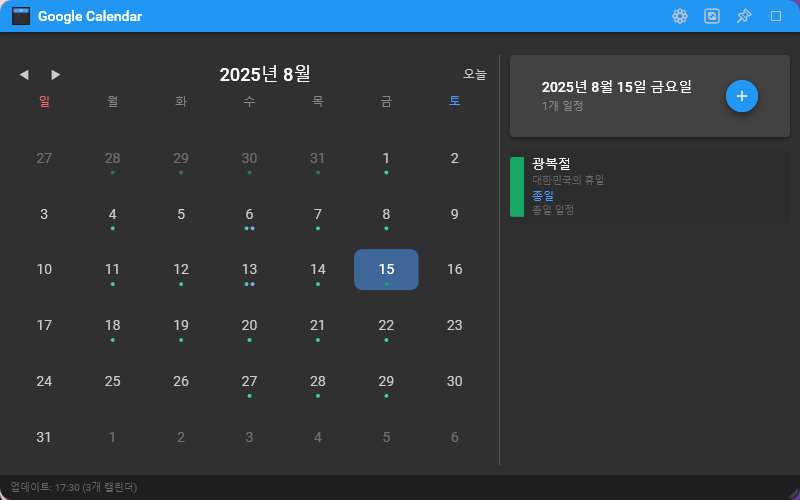

# 📅 Google Calendar Widget

WPF 기반 Google Calendar 데스크탑 위젯입니다.

## ✨ 주요 기능

- 🌙 **다크 테마**: Material Design 다크 모드 지원
- 📅 **캘린더 보기**: 월별 캘린더와 일정 표시
- ➕ **일정 관리**: 일정 추가, 수정, 삭제 기능
- ⚙️ **설정**: 투명도 조절, 캘린더 선택
- 🔄 **실시간 동기화**: Google Calendar와 실시간 동기화
- 📌 **시스템 트레이**: 최소화 시 시스템 트레이에 상주
- 🎨 **Material Design**: 현대적이고 직관적인 UI/UX

## 🎯 기능 상세

### 📅 캘린더 기능
- **월별 보기**: 현재 월의 캘린더 표시
- **일정 표시**: 각 날짜별 일정 개수와 상세 내용
- **날짜 선택**: 특정 날짜 클릭으로 해당 일정 보기

### ✏️ 일정 관리
- **일정 추가**: 제목, 시간, 설명, 위치 입력 가능
- **일정 수정**: 기존 일정 편집 (좌클릭 또는 우클릭 메뉴)
- **일정 삭제**: 안전한 삭제 확인 (우클릭 메뉴 또는 편집창)
- **종일 일정**: 종일 일정 설정 지원
- **시간 설정**: 시작/종료 시간 세밀 조정

### 🎨 UI/UX 특징
- **Material Design 4.9.0**: 안정적인 Material Design 컴포넌트
- **플로팅 힌트**: 입력 필드의 부드러운 애니메이션
- **아이콘**: 직관적인 Material Design 아이콘
- **반응형 레이아웃**: 창 크기에 따른 UI 적응
- **컨텍스트 메뉴**: 우클릭으로 빠른 일정 관리

## 🚀 시작하기

### 📋 필요 조건

- **Windows 10/11**
- **.NET 6.0** 이상
- **Google 계정** (Google Calendar API 사용)

### 🔧 설치 및 설정

1. **프로젝트 클론**
   ```bash
   git clone https://github.com/your-username/GoogleCalendarWidget.git
   cd GoogleCalendarWidget
   ```

2. **Google Calendar API 설정**

   #### 2.1 Google Cloud Console에서 프로젝트 생성
   1. [Google Cloud Console](https://console.cloud.google.com/)에 접속
   2. 새 프로젝트 생성 또는 기존 프로젝트 선택
   3. "API 및 서비스" → "라이브러리"로 이동
   4. "Google Calendar API" 검색 후 사용 설정

   #### 2.2 OAuth 2.0 클라이언트 ID 생성
   1. "API 및 서비스" → "사용자 인증 정보"로 이동
   2. "+ 사용자 인증 정보 만들기" → "OAuth 클라이언트 ID" 선택
   3. 애플리케이션 유형: **데스크톱 애플리케이션** 선택
   4. 이름: `GoogleCalendarWidget` (또는 원하는 이름)
   5. "만들기" 클릭

   #### 2.3 credentials.json 파일 다운로드
   1. 생성된 OAuth 클라이언트 옆의 다운로드 버튼 (⬇️) 클릭
   2. 다운로드된 JSON 파일을 `credentials.json`으로 이름 변경
   3. 프로젝트 루트 폴더(`GoogleCalendarWidget/`)에 복사
   
   ```
   GoogleCalendarWidget/
   ├── GoogleCalendarWidget/
   │   ├── credentials.json  ← 이 위치에 파일 배치
   │   ├── MainWindow.xaml
   │   └── ...
   └── README.md
   ```

3. **패키지 복원**
   ```bash
   dotnet restore
   ```

4. **빌드 및 실행**
   ```bash
   dotnet build
   dotnet run --project GoogleCalendarWidget
   ```

### 🔑 첫 실행 인증

1. 애플리케이션 실행 시 브라우저가 자동으로 열림
2. Google 계정으로 로그인
3. "GoogleCalendarWidget이 다음을 요청합니다" 화면에서 **허용** 클릭
4. "인증이 완료되었습니다" 메시지 확인 후 브라우저 닫기
5. 애플리케이션에서 캘린더 데이터 로드 시작

## 🎮 사용 방법

### 📅 기본 사용법
- **캘린더 탐색**: 좌/우 화살표로 월 이동
- **날짜 선택**: 날짜 클릭으로 해당 일정 보기
- **일정 추가**: 선택된 날짜의 `+` 버튼 클릭

### ✏️ 일정 관리
- **일정 편집**: 일정 항목 좌클릭
- **빠른 메뉴**: 일정 항목 우클릭 → 수정/삭제
- **종일 일정**: 편집창에서 "종일 일정" 체크박스 선택

### ⚙️ 설정
- **설정 열기**: 우상단 톱니바퀴(⚙️) 아이콘 클릭
- **투명도 조절**: 슬라이더로 창 투명도 조정
- **캘린더 선택**: 표시할 캘린더 체크박스로 선택

### 🔄 시스템 트레이
- **최소화**: 창 닫기 시 시스템 트레이로 최소화
- **복원**: 트레이 아이콘 더블클릭으로 창 복원
- **완전 종료**: 트레이 아이콘 우클릭 → "종료"

## 🏗️ 기술 스택

- **프레임워크**: WPF (.NET 6.0)
- **UI 라이브러리**: Material Design in XAML 4.9.0
- **API**: Google Calendar API v3
- **아키텍처**: MVVM 패턴
- **인증**: OAuth 2.0

## 📦 주요 NuGet 패키지

```xml
<PackageReference Include="Google.Apis.Calendar.v3" Version="1.69.0.3746" />
<PackageReference Include="Google.Apis.Auth" Version="1.70.0" />
<PackageReference Include="MaterialDesignThemes" Version="4.9.0" />
<PackageReference Include="MaterialDesignColors" Version="2.1.4" />
<PackageReference Include="Newtonsoft.Json" Version="13.0.3" />
```

## 🔒 보안 및 프라이버시

- **로컬 인증**: 인증 토큰은 로컬에만 저장
- **최소 권한**: Calendar 읽기/쓰기 권한만 요청
- **암호화**: Google OAuth 2.0 표준 암호화 사용
- **데이터**: Google 서버에서 직접 데이터 로드, 로컬 저장 안함

## 🐛 문제 해결

### 자주 발생하는 문제

#### "credentials.json 파일을 찾을 수 없음"
- `credentials.json` 파일이 올바른 위치에 있는지 확인
- 파일명이 정확한지 확인 (대소문자 구분)

#### "인증 오류"
- Google Cloud Console에서 OAuth 동의 화면 설정 확인
- 테스트 사용자에 본인 계정 추가 (게시 상태가 "테스트"인 경우)

#### "API 할당량 초과"
- Google Cloud Console에서 API 할당량 확인
- 요청 빈도 조절 또는 할당량 증가 요청

#### Material Design 스타일 오류
- .NET 6.0 SDK 설치 확인
- NuGet 패키지 복원: `dotnet restore`

## 🤝 기여하기

1. Fork the Project
2. Create your Feature Branch (`git checkout -b feature/AmazingFeature`)
3. Commit your Changes (`git commit -m 'Add some AmazingFeature'`)
4. Push to the Branch (`git push origin feature/AmazingFeature`)
5. Open a Pull Request

## 📄 라이선스

이 프로젝트는 MIT 라이선스 하에 배포됩니다. 자세한 내용은 `LICENSE` 파일을 참조하세요.

## 🙏 감사의 말

- [Material Design in XAML](https://github.com/MaterialDesignInXAML/MaterialDesignInXamlToolkit) - 아름다운 UI 컴포넌트
- [Google Calendar API](https://developers.google.com/calendar) - 강력한 캘린더 API
- [.NET Community](https://dotnet.microsoft.com/) - 훌륭한 개발 플랫폼

---

## 스크린샷

### 메인 화면
- 다크 테마 캘린더 보기
- 일정 목록과 상세 정보
- Material Design 버튼과 아이콘



### 일정 편집
- 직관적인 일정 편집 대화상자
- 플로팅 힌트 입력 필드
- 시간/날짜 선택기

### 설정 패널
- 투명도 조절 슬라이더
- 캘린더 선택 체크박스
- Material Design 스위치

---

**Made with ❤️ and Material Design**
